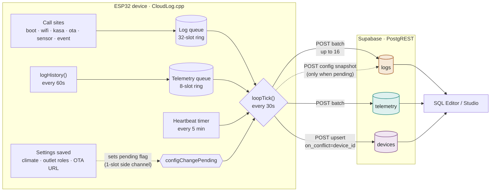

# CloudLog data flow & payload shapes

How a device's logs, sensor telemetry, and heartbeat travel from an ESP32's
RAM queues to Supabase — and the exact JSON each one sends over the wire.
Generated from [`src/CloudLog.cpp`](../src/CloudLog.cpp) and
[`scripts/supabase_schema.sql`](../scripts/supabase_schema.sql); see also the
[README's Cloud Logging section](../README.md#cloud-logging-remote-debugging).

firmware `0.3.0` (payload shapes below reflect the `temp_f`→`temp_c` rename
that shipped in `0.5.0` — see [`known-issues.md`](known-issues.md) for the
historical mixed-unit caveat this creates) · backend: Supabase / PostgREST

## Sending

Every call site mirrors to Serial and, when enabled, lands in one of two
fixed-size RAM ring buffers. `loopTick()` drains them over a single HTTPS
connection roughly every 30s, backing off to 5 minutes on repeated failure.



| | |
|---|---|
| Flush cadence | 30s → backs off to 5m |
| Log batch size | ≤ 16 entries / flush |
| Heartbeat | every 5 min, same connection |
| Config snapshot | ships once, on the next flush after a settings save |

The config snapshot is a deliberate side channel, not a third ring buffer:
`profile_config`/`outlet_roles` (a few hundred bytes of JSON) wouldn't fit
the log queue's fixed 120-char message field without growing every one of
its 32 entries for a rarely-used event. `CloudLog::logConfigChange()` just
sets a pending flag; the actual JSON is read fresh from the same providers
the heartbeat uses, at flush time — so only the latest settings matter if
several saves land within one 30s flush interval.

## Payload shapes

Four requests, four shapes (three of them all post to `logs`, distinguished
by `tag`). `logs` and `telemetry` post a JSON **array** of same-shaped
objects — PostgREST's bulk insert rejects a batch where objects don't share
identical keys, so optional fields are always present as explicit `null`
rather than omitted. `devices` posts a single object, upserted by
`device_id` — its `profile_config` field is a fresh snapshot of the
device's saved settings, read straight from flash at heartbeat time rather
than cached, so it's always current without any settings-save call site
needing to push an update of its own. Because that row is upserted, it only
ever reflects the *latest* save — the `config`-tagged `logs` row below is
what makes past settings queryable.

### `logs` — `POST /rest/v1/logs` · array, batched

An outlet transition (`tag: "event"`), carrying both the free-text message
and, since `outlet_index`/`outlet_state` were added, structured columns a
timeline reconstruction can read directly instead of parsing prose:

```json
{
  "device_id": "hs-2b93f4",
  "level": 2,                              // 0 ERR 1 WARN 2 INFO 3 DBG
  "tag": "event",
  "message": "Fan [3] turned ON — humidity at safety ceiling",
  "uptime_ms": 1234567,
  "device_time": "2026-07-17T20:06:01Z",   // null until NTP syncs
  "temp_c": 31.4,                          // null unless this entry
  "hum": 62.3,                             // has a snapshot
  "outlet_index": 3,                       // null on non-outlet log rows
  "outlet_state": true,                    // null on non-outlet log rows
  "outlet_roles": null,                    // only populated on tag='config'
  "profile_config": null                   // only populated on tag='config'
}
```

`level`: `0` error · `1` warn · `2` info · `3` debug

A settings-change snapshot (`tag: "config"`), sent once per save via the
side channel described above rather than through the normal log queue:

```json
{
  "device_id": "hs-2b93f4",
  "level": 2,
  "tag": "config",
  "message": "settings saved",
  "uptime_ms": 1234600,
  "device_time": "2026-07-17T20:07:15Z",
  "temp_c": null,
  "hum": null,
  "outlet_index": null,
  "outlet_state": null,
  "outlet_roles": ["Day Light", "Plug 2", "Heater", "Fan", "UVB Light"],
  "profile_config": { "profile": "Leopard Gecko", "enabled": true, "...": "..." }
}
```

`outlet_roles`/`profile_config` here are the same shape as on `devices`
(below) — querying the most recent `tag='config'` row at or before a given
timestamp answers "what were this device's settings as of time T," which
`devices` alone can't (it only ever holds the latest save).

### `telemetry` — `POST /rest/v1/telemetry` · array, batched

```json
{
  "device_id": "hs-2b93f4",
  "temp_c": 31.4,
  "hum": 62.3,
  "outlet_mask": 25,        // bit i set → outlet i is on (25 = 0b00011001)
  "free_heap": 187344,
  "rssi": -58
}
```

Sampled alongside `logHistory()`, every 60s.

### `devices` — `POST /rest/v1/devices?on_conflict=device_id` · single object, upsert

```json
{
  "device_id": "hs-2b93f4",
  "name": "Terrarium A",
  "fw_version": "0.3.0",
  "ip": "192.168.1.42",
  "rssi": -58,
  "free_heap": 187344,
  "uptime_ms": 1234567,
  "active_backend": "kasa",
  "reset_reason": "power-on",
  "outlet_roles": ["Day Light", "Plug 2", "Heater", "Fan", "UVB Light"],
  "profile_config": {
    "profile": "Leopard Gecko",
    "enabled": true,
    "temp_low_c": 24.0,
    "temp_high_c": 32.0,
    "hum_low": 30,
    "hum_high": 50,
    "day_light_on": "08:00",
    "day_light_off": "20:00",
    "uvb_on": "09:00",
    "uvb_off": "17:00",
    "timezone": "US Eastern",
    "ota_url": ".../latest.json",
    "kasa_ip": "192.168.1.87"   // only when Kasa is the active backend
  }
}
```

- `outlet_roles[i]` names `outlet_mask` bit *i*.
- `profile_config` never carries Kasa account credentials or the device's
  own Supabase anon key — only settings, never secrets.
